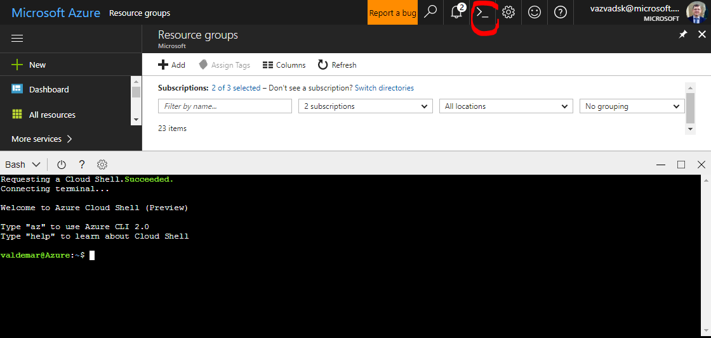

# DEVOPS JAVA - Kubernetes (jenkins, helm), PostgreSQL, ACR

This demo contains simple one page web app with REST API backend (dockerized JAVA Spring Boot application) and Azure PostgreSQL DB for data persistence.
Whole solutions run in kubernetes cluster (Azure Container Services), CI/CD pipeline also runs in kubernetes cluster and is powered by Jenkins - master node of Jenkins run like separate Pod, all build agents are provisioned on-fly like separate build-agent nodes.

### Demonstrated DEVOPS scenario:
* automatically create infrastructure environment Kubernetes (with Jenkins), ACR, PostgreSQL).
* configured Jenkins with build job - Jenkins is able to build Maven project, push docker images to Azure Container Registry and deploy application via helm to kubernetes cluster.
* PostgreSQL is configured with enabled firewall rules to all IP addresses.
* Kubernetes cluster is preconfigured with secrets for accessing Application Insights (Instrumentation key) and JDBC connection string to postgres DB.

### SpringBoot app:
* exposes REST APIs for listing ToDoes, creating and editing ToDo records.
* fronted is created in AngularJS 1.* and connected to backend REST APIs
* database table in PostgreSQL database is created automatically during application start 


### Solution can be provisioned by this simple script from Azure Cloud Shell:
* **prerequisites**
 * you need your SSH (private and public) key prepared in cloud shell 
 * public ssh key is in file `~/.ssh/id_rsa.pub`
* run Azure Cloud Shell
* 
* There run install script and provide necessary parameters
* `curl -s https://raw.githubusercontent.com/valda-z/devops-azure-multiplatform/java-k8s/run.sh | bash -s -- --location southcentralus --resource-group KUBE --kubernetes-name valdakube --acr-name valdakubeacr --postgresql-name valdakubepostgres --jenkins-password kube123`
* supported parameters are:
 * Mandatory
     * `--location` - Azure region for resource group and all resources 
     * `--resource-group` - Azure resource group name (will be created by script)
     * `--kubernetes-name` - Unique name for kubernetes cluster 
     * `--acr-name` - **Unique** name for Azure Container Registry 
     * `--postgresql-name` - **Unique** name of PostgreSQL instance in Azure 
 * Optional (if not provided than script uses defaults - see script)
     * `--postgresql-user` - Azure region for resource group and all resources 
     * `--postgresql-password` - Azure region for resource group and all resources 
     * `--jenkins-password` - Azure region for resource group and all resources 

### After successful deployment:
* you can reach deployed Jenkins server (see DNS name on Overview pane of Jenkins Virtual Machine `http://[YUOR-JENKINS-IP]:8080` - you can see IP address of jenkins (and also uasername and password) in install script results
* You have to build docker image - from Jenkis management console `http://[YUOR-JENKINS-IP]:8080` you can run build action on task `MyJava`
* you can reach your application from web browser on URL: `https://[YOUR-WEBAPP-IP]`, public IP address of your application can be obtained from kubernetes control plane UI or from Azure Cloud Shell by running command `kubectl get services` 

#### SonarQube integration - code analaysis and quality gate
* Install SonarQube via helm: `linux-amd64/helm install stable/sonarqube`
* after successfull instalation you can get public IP address of SonarQube by `kubectl get services`
* SonarQube default username is `admin` and default password is `admin`
* Install these plugins `SonarQube Scanner for Jenkins` ;`Pipeline Utility Steps` and `HTTP Request Plugin`
* Configure Sonar in Jenkins Configuration -> "Configure System" (URL of Sonar, API Key, Name: `SONAR`)
 * Process how to generate API key in SonarQube:
     * Go to User  -> My Account setting (top right menu item)
	 * Security tab
	 * Generate token 
* Change Jenkins Jenkins Pipeline
 * Pipeline like a Script edited in Jenkins (use source file ./src/main/jenkins/Jenkinsfile
 * insert new stage just after `Maven build` stage

```groovy
container(name: 'maven') {
	stage('SonarQube analysis') {
		withSonarQubeEnv('SONAR') {
			sh 'mvn -Dsonar.host.url=http://estranged-mule-sonarqube:9000 -Dsonar.login=f588XXXXXXXXXXXXXXXXXXXXXXXXXXXXXXXXXX19 org.sonarsource.scanner.maven:sonar-maven-plugin:3.2:sonar'
		}
	}
	stage("Quality Gate"){
		def props = readProperties file: 'target/sonar/report-task.txt'
		echo "properties=${props}"
		def sonarServerUrl=props['serverUrl']
		def ceTaskUrl= props['ceTaskUrl']
		def ceTask
		timeout(time: 10, unit: 'MINUTES') {
			waitUntil {
				def response = httpRequest ceTaskUrl
				ceTask = readJSON text: response.content
				echo ceTask.toString()
				return "SUCCESS".equals(ceTask["task"]["status"])
			}
		}
		def response2 = httpRequest url : sonarServerUrl + "/api/qualitygates/project_status?analysisId=" + ceTask["task"]["analysisId"]
		def qualitygate = readJSON text: response2.content
		echo qualitygate.toString()
		if ("ERROR".equals(qualitygate["projectStatus"]["status"])) {
			error "Quality Gate failure"
		}
	}
}
```
 
 
#### Possible optimalization
* create special docker image for build with customized build environment
* use persistent volume for maven build agent - it can decrease build time because of persistent artifact of maven (in our case these artifacts have to be loaded each time than build is triggered.
* install SonarQuebe and plug sonar agent to CI/CD pipeline.

